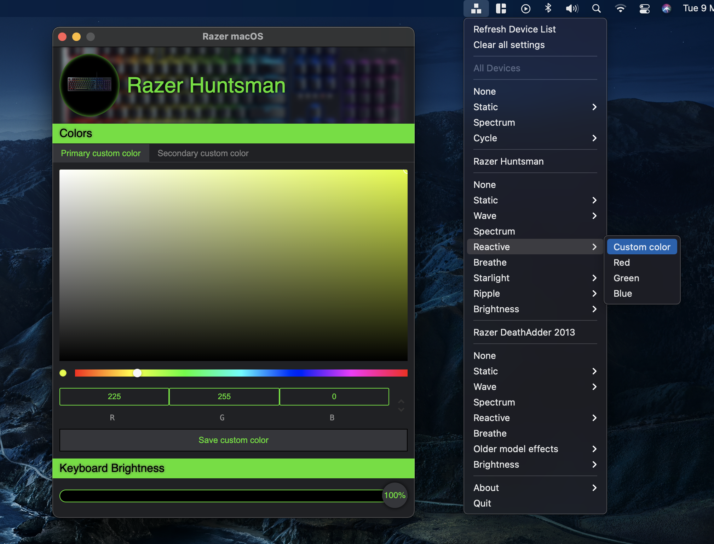

  
  
Open source color effects manager for Razer devices on macOS

  

- **Supporting Razer devices** Keyboards, mice, mouse mats, eGPUs and blade laptops
- **Custom color picking** Choose your own colors for static, reactive and starlight effects
- **Persistent color settings** Color effects are saved to onboard memory
- **Works on the latest macOS** Including Intel and Apple Silicon. There are no plans from Razer to further support macOS ([source](https://support.razer.com/articles/1543762911))

## Download

[Latest release](https://github.com/1kc/razer-macos/releases)

## Installation instructions

Install by drag and drop to Applications.
If you get a security warning when opening the app, you need to go to your Mac's "System Preferences", "Security and Privacy", "General" and click "Open" at the bottom to allow Razer macOS to run.

Please see FAQ section below if color changes are not working, otherwise open a new issue.

## Device support

- ⌨️ Keyboard
- 🖱️ Mouse
- 📜 Mouse mat
- 🌈 e-GPU
- 🎧 Headphones and stand
- 💻 Blade laptop
- 🔊 Speakers
- 🍺 Mug
- ⭐️ And More

For a complete list of supported devices, please see [openrazer](https://openrazer.github.io).

Confirmed working for:

Keyboards:

- Razer Anansi
- Razer BlackWidow 2019
- Razer BlackWidow Chroma
- Razer BlackWidow Chroma Tournament Edition
- Razer BlackWidow Chroma V2
- Razer BlackWidow Elite
- Razer BlackWidow Essential
- Razer BlackWidow Lite
- Razer BlackWidow Overwatch
- Razer BlackWidow Stealth
- Razer BlackWidow Stealth Edition
- Razer BlackWidow Ultimate 2012
- Razer BlackWidow Ultimate 2013
- Razer BlackWidow Ultimate 2016
- Razer BlackWidow V3
- Razer BlackWidow V3 Pro (wired)
- Razer BlackWidow V3 TK
- Razer BlackWidow X Chroma
- Razer BlackWidow X Chroma Tournament Edition
- Razer BlackWidow X Chroma Ultimate
- Razer Cynosa Chroma
- Razer Cynosa Lite
- Razer Cynosa V2
- Razer Deathstalker Chroma
- Razer Deathstalker Expert
- Razer Huntsman
- Razer Huntsman Elite
- Razer Huntsman Mini
- Razer Huntsman Tournament Edition
- Razer Huntsman V2
- Razer Huntsman V2 Analog
- Razer Nostromo
- Razer Orbweaver
- Razer Orbweaver Chroma
- Razer Ornata
- Razer Ornata Chroma
- Razer Ornata Chroma V2
- Razer Tartarus
- Razer Tartarus Chroma
- Razer Tartarus V2

Mice:

- Razer Abyssus 
- Razer Abyssus 1800
- Razer Abyssus 2000
- Razer Abyssus Elite DVA Edition
- Razer Abyssus Essential
- Razer Abyssus V2 (under older mouse effects)
- Razer Basilisk
- Razer Basilisk Essential
- Razer Basilisk Ultimate
- Razer Basilisk V2
- Razer Basilisk V3
- Razer DeathAdder 3 5G
- Razer DeathAdder 1800
- Razer DeathAdder 2013 (under older mouse effects)
- Razer DeathAdder 3500
- Razer DeathAdder Chroma
- Razer DeathAdder Elite
- Razer DeathAdder Essential
- Razer DeathAdder Essential White Edition
- Razer DeathAdder Essential (2021)
- Razer DeathAdder V2
- Razer DeathAdder V2 Mini
- Razer DeathAdder V2 Pro (wired and wireless)
- Razer Diamondback Chroma
- Razer Imperator
- Razer Lancehead Tournament Edition
- Razer Lancehead Wired
- Razer Lancehead Wireless (and wired)
- Razer Mamba 2012 (wired and wireless)
- Razer Mamba Elite
- Razer Mamba Tournament Edition
- Razer Mamba Wired
- Razer Mamba Wireless (and wired)
- Razer Naga 2012
- Razer Naga 2014
- Razer Naga Chroma
- Razer Naga Hex
- Razer Naga Hex Red
- Razer Naga Hex V2
- Razer Naga Left Handed 2020
- Razer Naga Pro (wired and wireless)
- Razer Naga Trinity
- Razer Orochi 2011
- Razer Orochi 2013
- Razer Orochi Chroma
- Razer Ouroboros
- Razer Taipan
- Razer Viper
- Razer Viper 8KHz
- Razer Viper Mini
- Razer Viper Ultimate (wired and wireless)

Mouse mats:

- Razer Firefly
- Razer Firefly Hyperflux
- Razer Firefly V2
- Razer Goliathus Chroma
- Razer Goliathus Chroma Extended

e-GPUs:

- Razer Core X Chroma

Headphones and stand:

- Razer Base Station V2 Chroma
- Razer Kraken
- Razer Kraken 7.1
- Razer Kraken 7.1 (Alternate)
- Razer Kraken Kitty Edition
- Razer Kraken Ultimate
- Razer Kraken V2

Laptops:

- Razer Blade 2018
- Razer Blade 2019 Advanced
- Razer Blade 2018 Base
- Razer Blade 2019 Base
- Razer Blade 2018 Mercury
- Razer Blade Late-2016
- Razer Blade Mid-2019 Mercury
- Razer Blade Pro 2017
- Razer Blade Pro 2017 Full HD
- Razer Blade Pro Late-2016
- Razer Blade Stealth
- Razer Blade Stealth 2019
- Razer Blade Stealth Late-2016
- Razer Blade Stealth Mid-2017
- Razer Blade Stealth Late-2017
- Razer Blade Stealth Late-2019
- Razer Blade Studio Edition 2019
- Razer Blade QHD

Speakers:

- Razer Nommo Chroma
- Razer Nommo Pro

Mugs: 

- Razer Chroma Mug
- Razer Chroma Base
- Razer Chroma HDK

Accessories:

- Razer Mouse Bungee V3 Chroma
- Razer Mouse Charging Dock
- Razer Thunderbolt 4 Dock Chroma

Please feel free to open pull requests for new devices you have tested.

## FAQ

Q: Selecting a colour setting has no effect on my keyboard.

A: It is possible that a wrong on-board keyboard profile has been selected. Change to a different profile and try again. See your device manual for specific instructions on how to switch profiles.

Q: Menu says "No device found".

A: Use the "Refresh Device List" option, which can be found when pressing the Razer OS icon on the top menu bar.

Q: How do I customize and rebind keys?

You might find the [Karabiner-elements](https://karabiner-elements.pqrs.org/) tool helpful.

## Device Support Policy

Ongoing new device support will be provided on a volunteer contribution basis, as it is difficult for someone who does not own the physical devices to be adding support and conducting tests.

## Developer usage

    git clone --recursive https://github.com/1kc/razer-macos.git

Ensure xcode command line tools are installed,

If you have a paid Apple Developer account, edit `release.sh` with your details.

 Afterwards, to automatically build, sign, and/or notarize (if applicable,) run in Terminal: `./release.sh`

 Ad-hoc signing will be used if account information is left empty.

 Or build manually:

Install node package dependencies:

    yarn

Run development server:

    yarn dev

During development, every time the driver code has been updated, a rebuild is required:

    yarn rebuild

For building a distribution ready app and dmg:

    yarn dist

Sign the universal package before moving to /Applications folder with ad-hoc signing:

    codesign -s - --deep --force ./dist/mac-universal/Razer\ macOS.app

## Implementation

Project includes both hardware drivers and user interface.

Drivers are ported from the [openrazer](https://github.com/openrazer/openrazer) project for Linux.
The goal is to support all devices from openrazer on macOS.

An Electron macOS menu bar app is used for the user interface.
The C driver is exposed as a native Node.js addon using node-addon-api, which gets invoked by Electron at runtime to send packets to devices.

Adding support for new peripherals types requires porting from the openrazer project. See [wiki](https://github.com/1kc/razer-macos/wiki).

## Credits

Builds on work done by these amazing projects:

- [openrazer](https://github.com/openrazer/openrazer)
- [osx-razer-blade](https://github.com/kprinssu/osx-razer-blade)
- [osx-razer-led](https://github.com/dylanparker/osx-razer-led)
